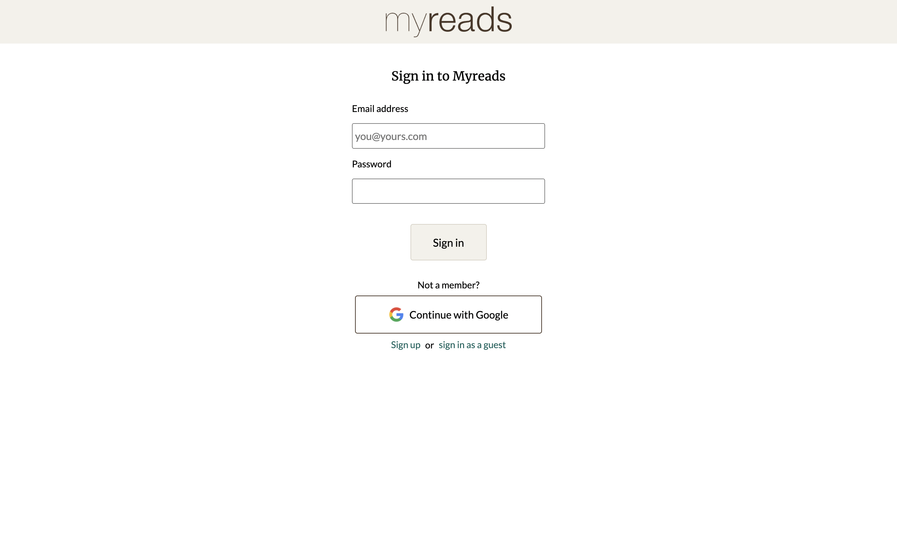
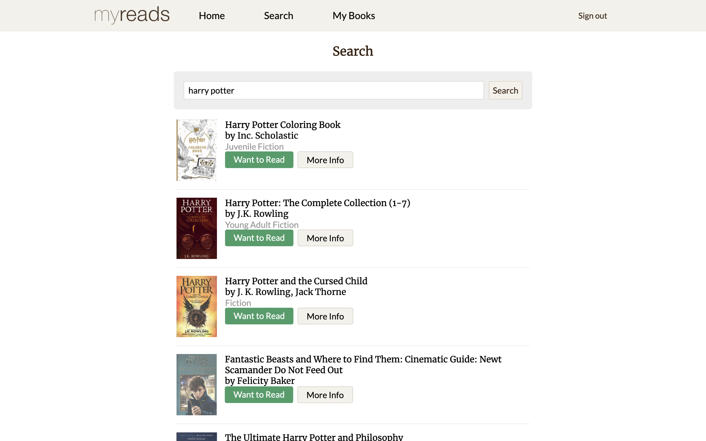

# 📚 Myreads
Myreads is a Goodreads clone with functionality to search and retrieve book information

## Screenshots
### Sign In Page

### Search Page

## Features
- Sign in with email/password, Google, or as a guest 
- Search for books and view additional details for them

## Tools Used
- React
- Styled Components
- Firebase authentication
- HTML
- CSS
- [Google Books API](https://developers.google.com/books)

## Future Features
- Allow uses to add books to their bookshelves (Want to read, read, and currently reading)
- Implement Firebase Cloud Firestore to store user book data
- Allow users to rate the books they've read
